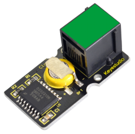
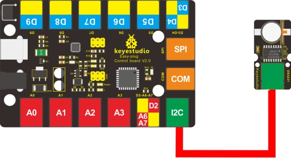
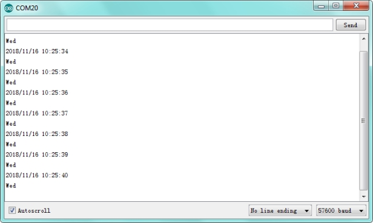

# KS0130 keyestudio EASY plug DS3231 Clock Module



## 1. Introduction

The DS3231 is a low-cost, extremely accurate I2C real-time clock (RTC) with an integrated temperature-compensated crystal oscillator (TCXO) and crystal.

A real-time clock (RTC) is a computer clock (most often in the form of an integrated circuit) that keeps track of the current time.

It integrated with a battery input, which can maintain accurate timekeeping when power off. The integrated crystal resonator ensures the accuracy of clock. So this RTC solution should be worth to try.

This module should be used together with EASY plug control board.

**Special Note:**

The sensor/module is equipped with the RJ11 6P6C interface, compatible with our keyestudio EASY plug Control Board with RJ11 6P6C interface.

If you have the control board of other brands, it is also equipped with the RJ11 6P6C interface but has different internal line sequence, can’t be used compatibly with our sensor/module.

**The backup battery is a CR1220, with a voltage of 3V and a current of 40mAh. It is a non-rechargeable battery. Theoretically, the data retention time is more than 1 year.**

## 2. Specification

- Temperature range: -40℃ to +85℃
- Timing accuracy: about ± 5ppm
- Output: 1Hz and 32.768kHz
- High speed (400kHz), I2C serial bus
- Supply voltage: 3.3V to 5.5V
- Output Level: TTL level

## 3. Technical Details

- Dimensions: 38mm * 20mm * 18mm
- Weight: 5.4g

## 4. Connect It Up

Connect the EASY Plug DS3231 Clock module to control board using an RJ11 cable. Then connect the control board to your PC with a USB cable.



## 5. Upload the Code

Download Resource :  [Resource](./Resource.7z)

Note： before uploading the code, you need to import the library files; otherwise, the code upload will fail.

```c
#include <Wire.h>   // place file “Wire.h” under the directory “libraries” of Arduino
#include "DS3231.h"  // place file “DS3231.h” under the directory “libraries” of Arduino
DS3231 RTC;//Create the DS3231 object
char weekDay[][4] = {"Sun","Mon","Tue","Wed","Thu","Fri","Sat"};
//year, month, date, hour, min, sec and week-day(starts from 0 and goes to 6)
//writing any non-existent time-data may interfere with normal operation of the RTC.
//Take care of week-day also.
DateTime dt(2018,11,16,10,25,33,3);
//open the series port and you can check time here or make a change to the time as needed.

void setup ()
{ 
    Serial.begin(57600);//set baud rate to 57600
    Wire.begin();
    RTC.begin();
    RTC.adjust(dt);//Adjust date-time as defined 'dt' above 
}

void loop ()
{ 
    DateTime now=RTC.now();//get the current date-time
    Serial.print(now.year(),DEC);
    Serial.print('/');
    Serial.print(now.month(),DEC);
    Serial.print('/');
    Serial.print(now.date(),DEC);
    Serial.print(' ');
    Serial.print(now.hour(),DEC);
    Serial.print(':');
    Serial.print(now.minute(),DEC);
    Serial.print(':');
    Serial.print(now.second(),DEC);
    Serial.println();
    Serial.print(weekDay[now.dayOfWeek()]);
    Serial.println();
    delay(1000);
}
```

## 6. Result

Done uploading the code, open the serial monitor and set the baud rate to 57600, you should be able to see the time and the date. 

